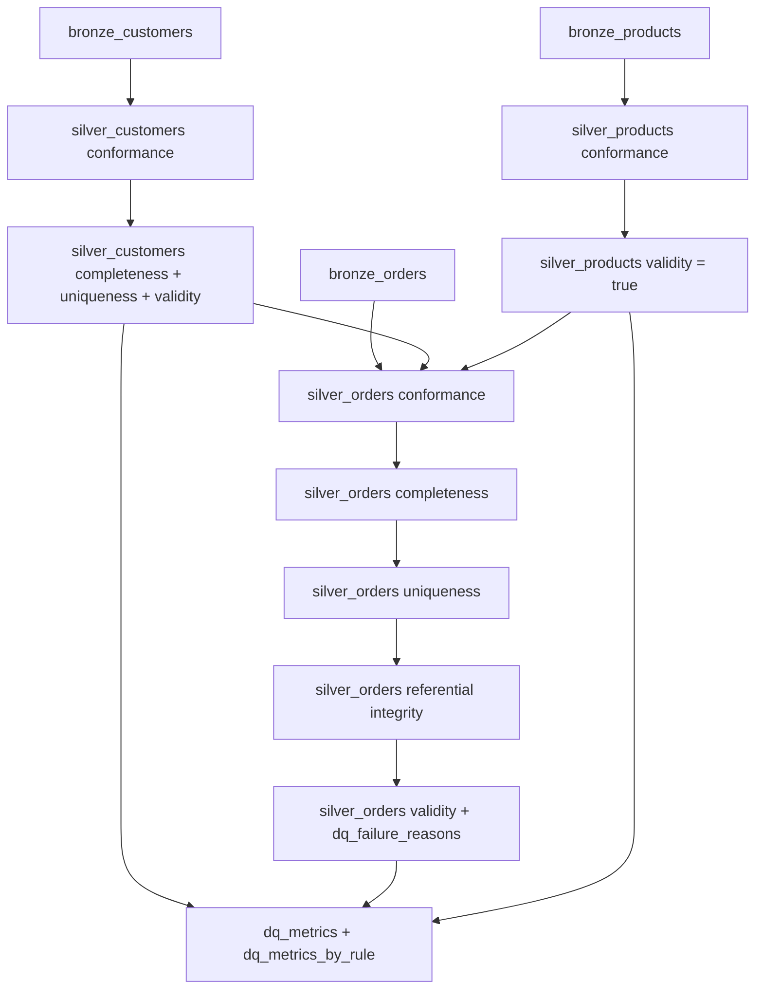

# Phase 7 — Silver Layer Implementation Specification

**Status:** Specification only — do not implement until instructed  
**Source of truth:** `data-model.md`, `data-quality-strategy.md`, `design-notes.md`  
**Prerequisite:** Phase 6 Bronze ingestion complete (`bronze_customers`, `bronze_orders`, `bronze_products`)

---

## 1. Objective

Implement the Silver layer to:

1. Read Bronze Delta tables without losing rows.
2. Apply approved **conformance** transformations (trim, cast, `line_revenue`).
3. Apply approved **data-quality validation** as separate, reviewable rule modules.
4. Preserve **all** Bronze rows and intentional Phase 5 DQ issues.
5. Add per-rule boolean flags, overall `is_valid_record`, and optional `dq_failure_reasons`.
6. Publish measurable DQ outputs in `dq_metrics` and `dq_metrics_by_rule`.

Silver is the validation and conformance layer. It must **identify, flag, and measure** quality problems — never hide them by deleting, deduplicating, or repairing source records.

---

## 2. Inputs from Bronze

### 2.1 Source tables

| Bronze table | Expected row count | Silver output |
|---|---|---|
| `bronze_customers` | 10,015 | `silver_customers` |
| `bronze_orders` | 100,035 | `silver_orders` |
| `bronze_products` | 500 | `silver_products` |

Default qualified names (configurable):

- `medallion_eval.bronze.bronze_customers`
- `medallion_eval.bronze.bronze_orders`
- `medallion_eval.bronze.bronze_products`

### 2.2 Bronze business columns (carried into Silver, conformed)

**Customers:** `customer_id`, `customer_name`, `email`, `registration_date`, `country`, `signup_channel`

**Orders:** `order_id`, `customer_id`, `product_id`, `order_date`, `quantity`, `unit_price`

**Products:** `product_id`, `product_name`, `category`, `list_price`, `is_active`

### 2.3 Bronze metadata columns (preserved in Silver)

Per `data-model.md`, Silver includes all Bronze columns (conformed) plus Silver-specific columns. Preserve Bronze lineage metadata:

- `_ingest_batch_id`
- `_ingest_timestamp`
- `_source_file`
- `_source_row_number`
- `_bronze_record_id`

### 2.4 Read behavior

- Read Bronze tables via configurable Delta paths / qualified names.
- Do **not** filter, deduplicate, or repair rows during read.
- Bronze string-preserving values flow into Silver conformance unchanged except for approved trim/cast operations.

---

## 3. Silver Tables

Default schema: `medallion_eval.silver`  
Write mode: Delta `overwrite` (full refresh per run, consistent with Bronze/Gold design)

### 3.1 `silver_customers`

**Grain:** 1 row per Bronze customer row (10,015 rows)

| Column group | Columns |
|---|---|
| Conformed business columns | `customer_id`, `customer_name`, `email`, `registration_date`, `country`, `signup_channel` |
| Bronze metadata | `_ingest_batch_id`, `_ingest_timestamp`, `_source_file`, `_source_row_number`, `_bronze_record_id` |
| Completeness flag | `is_email_complete` |
| Uniqueness flag | `is_customer_id_unique` |
| Overall validity | `is_valid_record` |
| Diagnostics | `dq_failure_reasons` (array\<string\>, optional per design) |

### 3.2 `silver_orders`

**Grain:** 1 row per Bronze order row (100,035 rows)

| Column group | Columns |
|---|---|
| Conformed business columns | `order_id`, `customer_id`, `product_id`, `order_date`, `quantity`, `unit_price` |
| Derived measure | `line_revenue` |
| Bronze metadata | `_ingest_batch_id`, `_ingest_timestamp`, `_source_file`, `_source_row_number`, `_bronze_record_id` |
| Completeness flags | `is_customer_id_complete`, `is_product_id_complete` |
| Uniqueness flag | `is_order_id_unique` |
| Referential-integrity flags | `is_customer_id_valid_ref`, `is_product_id_valid_ref` |
| Overall validity | `is_valid_record` |
| Diagnostics | `dq_failure_reasons` |

### 3.3 `silver_products`

**Grain:** 1 row per Bronze product row (500 rows)

| Column group | Columns |
|---|---|
| Conformed business columns | `product_id`, `product_name`, `category`, `list_price`, `is_active` |
| Bronze metadata | `_ingest_batch_id`, `_ingest_timestamp`, `_source_file`, `_source_row_number`, `_bronze_record_id` |
| Overall validity | `is_valid_record` (always `true`) |

Products have **no required DQ rule flags** beyond `is_valid_record`.

---

## 4. Conformance Transformations

Applied in Silver only (not Bronze). Per `data-model.md` §8.1:

| Transformation | Entity | Rule |
|---|---|---|
| Trim string whitespace | customers, orders, products | `trim()` all string business columns |
| Cast `quantity` | orders | integer |
| Cast `unit_price`, `list_price` | orders, products | `decimal(10,2)` |
| Cast `registration_date`, `order_date` | customers, orders | `date` |
| Cast `is_active` | products | `boolean` |
| Compute `line_revenue` | orders | `quantity * unit_price` → `decimal(10,2)` |

**Conformance module responsibilities:**

- Perform approved type conversions only.
- Do **not** fix missing values, duplicate keys, or invalid references.
- Do **not** drop rows that fail casting; preserve row and let DQ flags reflect issues where applicable.

---

## 5. Completeness Rules

Separate module. Per `data-quality-strategy.md` §5.1.

Null and blank (after trim) are both treated as missing.

| Flag | Entity | Field | `true` when |
|---|---|---|---|
| `is_email_complete` | customers | `email` | `email` is not null and `trim(email) != ''` |
| `is_customer_id_complete` | orders | `customer_id` | `customer_id` is not null and `trim(customer_id) != ''` |
| `is_product_id_complete` | orders | `product_id` | `product_id` is not null and `trim(product_id) != ''` |

**Issue codes for `dq_failure_reasons`:**

| Flag failure | `issue_code` |
|---|---|
| `is_email_complete = false` | `CUST_EMAIL_MISSING` |
| `is_customer_id_complete = false` | `ORD_CUST_ID_MISSING` |
| `is_product_id_complete = false` | `ORD_PROD_ID_MISSING` |

Completeness checks must be implemented **separately** from uniqueness and referential integrity.

---

## 6. Uniqueness Rules

Separate module. Per `data-quality-strategy.md` §5.2.

| Flag | Entity | Key | `true` when |
|---|---|---|---|
| `is_customer_id_unique` | customers | `customer_id` | appears exactly once in `silver_customers` |
| `is_order_id_unique` | orders | `order_id` | appears exactly once in `silver_orders` |

**Critical rule:** When duplicates exist, **all rows sharing the duplicated key** receive `false`. Do **not** select a winner. Do **not** deduplicate.

**Issue code for `dq_failure_reasons`:**

| Flag failure | `issue_code` |
|---|---|
| `is_customer_id_unique = false` | `CUST_ID_DUPLICATE` |
| `is_order_id_unique = false` | `ORD_ID_DUPLICATE` |

---

## 7. Referential-Integrity Rules

Separate module. Per `data-quality-strategy.md` §5.3.

| Flag | Entity | Reference | `true` when |
|---|---|---|---|
| `is_customer_id_valid_ref` | orders | `silver_customers.customer_id` | `customer_id` exists in `silver_customers.customer_id` |
| `is_product_id_valid_ref` | orders | `silver_products.product_id` | `product_id` exists in `silver_products.product_id` |

**Critical rules:**

- Check existence in the **corresponding Silver entity table**.
- Do **not** require the referenced row to pass its own `is_valid_record` flags.
- RI evaluation occurs after `silver_customers` and `silver_products` are populated (orders RI runs after reference tables exist).

**Issue codes for `dq_failure_reasons`:**

| Flag failure | `issue_code` |
|---|---|
| `is_customer_id_valid_ref = false` | `ORD_CUST_ID_INVALID` |
| `is_product_id_valid_ref = false` | `ORD_PROD_ID_INVALID` |

---

## 8. Overall `is_valid_record` Logic

Per `data-quality-strategy.md` §5.4:

| Entity | Formula |
|---|---|
| customers | `is_email_complete AND is_customer_id_unique` |
| orders | `is_customer_id_complete AND is_product_id_complete AND is_order_id_unique AND is_customer_id_valid_ref AND is_product_id_valid_ref` |
| products | always `true` |

Invalid orders and customers **remain in Silver** with `is_valid_record = false`. They are excluded later from Gold calculations (Phase 8), not removed in Silver.

---

## 9. `dq_failure_reasons`

Optional diagnostic column per `data-quality-strategy.md` §5.5.

| Property | Specification |
|---|---|
| Type | `array<string>` |
| Content | Stable `issue_code` values for each failed rule on the row |
| Purpose | Debugging and traceability; not a substitute for per-rule boolean flags |

**Mapping (approved issue codes only):**

| `issue_code` | Trigger |
|---|---|
| `CUST_EMAIL_MISSING` | `is_email_complete = false` |
| `CUST_ID_DUPLICATE` | `is_customer_id_unique = false` |
| `ORD_CUST_ID_MISSING` | `is_customer_id_complete = false` |
| `ORD_PROD_ID_MISSING` | `is_product_id_complete = false` |
| `ORD_ID_DUPLICATE` | `is_order_id_unique = false` |
| `ORD_CUST_ID_INVALID` | `is_customer_id_valid_ref = false` |
| `ORD_PROD_ID_INVALID` | `is_product_id_valid_ref = false` |

A row may contain multiple codes only if multiple rules fail on that row. The approved Phase 5 injection plan keeps cohorts mutually exclusive per manifest row; tests align to per-rule counts.

---

## 10. Row-Count Preservation

| Rule | Requirement |
|---|---|
| `silver_customers` rows | **must equal** `bronze_customers` rows (10,015) |
| `silver_orders` rows | **must equal** `bronze_orders` rows (100,035) |
| `silver_products` rows | **must equal** `bronze_products` rows (500) |
| Row removal | **Prohibited** |
| Deduplication | **Prohibited** |
| Silent repair of DQ issues | **Prohibited** |

Implementation must assert row-count parity after each Silver table write.

---

## 11. DQ Metrics Tables

Default schema: `medallion_eval.dq`  
Per `data-model.md` §10.

### 11.1 `dq_metrics` (run-level)

| Column | Type | Definition |
|---|---|---|
| `metric_run_id` | string | Silver pipeline run identifier |
| `metric_timestamp` | timestamp | UTC capture time |
| `dataset` | string | `customers`, `orders`, or `products` |
| `total_records` | long | Total Silver rows for entity |
| `valid_records` | long | `is_valid_record = true` count |
| `invalid_records` | long | `is_valid_record = false` count |
| `valid_record_pct` | double | `valid_records / total_records` |

One row per entity per run (3 rows per run).

### 11.2 `dq_metrics_by_rule` (rule-level)

| Column | Type | Definition |
|---|---|---|
| `metric_run_id` | string | Silver pipeline run identifier |
| `dataset` | string | Entity name |
| `rule_code` | string | Stable issue code |
| `rule_category` | string | `completeness`, `uniqueness`, or `referential_integrity` |
| `failed_record_count` | long | Rows where the specific rule flag is `false` |
| `expected_failed_count` | long | Approved expected count from injection plan |

One row per rule per run (7 rows per run).

### 11.3 Metrics definitions

| Metric | How to compute |
|---|---|
| `failed_record_count` | Count rows where the mapped boolean flag is `false` |
| `valid_records` | Count rows where `is_valid_record = true` |
| `invalid_records` | Count rows where `is_valid_record = false` |

---

## 12. Expected DQ Failure Counts

From approved `data-quality-strategy.md` §6.3 and Phase 5 injection manifest.

| `issue_code` | `rule_category` | `dataset` | `expected_failed_count` |
|---|---|---|---|
| `CUST_EMAIL_MISSING` | completeness | customers | 50 |
| `CUST_ID_DUPLICATE` | uniqueness | customers | 30 |
| `ORD_CUST_ID_MISSING` | completeness | orders | 100 |
| `ORD_PROD_ID_MISSING` | completeness | orders | 100 |
| `ORD_ID_DUPLICATE` | uniqueness | orders | 70 |
| `ORD_CUST_ID_INVALID` | referential_integrity | orders | 200 |
| `ORD_PROD_ID_INVALID` | referential_integrity | orders | 150 |
| **Total** | | | **700** |

Tests must assert `failed_record_count = expected_failed_count` for each rule after a full Silver run on generated project data.

**Flag-to-count mapping for tests:**

| Rule flag | Expected `failed_record_count` |
|---|---|
| `is_email_complete = false` | 50 |
| `is_customer_id_unique = false` | 30 |
| `is_customer_id_complete = false` | 100 |
| `is_product_id_complete = false` | 100 |
| `is_order_id_unique = false` | 70 |
| `is_customer_id_valid_ref = false` | 200 |
| `is_product_id_valid_ref = false` | 150 |

---

## 13. Required Test Coverage

Phase 7 tests only (do not implement Gold tests in this phase). Use pytest + local SparkSession (same pattern as Bronze).

### 13.1 Row-count and preservation

- Silver row counts equal Bronze row counts per entity.
- No rows dropped across Bronze → Silver.

### 13.2 Conformance

- String business columns trimmed.
- Approved casts applied (`quantity`, `unit_price`, `list_price`, dates, `is_active`).
- `line_revenue = quantity * unit_price` on orders.

### 13.3 Completeness

- 50 customers with `is_email_complete = false`.
- 100 orders with `is_customer_id_complete = false`.
- 100 orders with `is_product_id_complete = false`.

### 13.4 Uniqueness

- 30 customer rows with `is_customer_id_unique = false` (15 duplicate keys × 2 rows each).
- 70 order rows with `is_order_id_unique = false` (35 duplicate keys × 2 rows each).
- All rows sharing a duplicated key are flagged `false`.

### 13.5 Referential integrity

- 200 orders with `is_customer_id_valid_ref = false`.
- 150 orders with `is_product_id_valid_ref = false`.
- RI checks reference ID existence in Silver tables only (referenced row validity not required).

### 13.6 Overall validity

- `is_valid_record` formulas match approved definitions per entity.
- `silver_products.is_valid_record` is always `true`.

### 13.7 Metrics

- `dq_metrics` has 3 rows per run with correct totals.
- `dq_metrics_by_rule` has 7 rows per run.
- Each `failed_record_count` matches expected counts in §12.

### 13.8 Intentional DQ preservation

- Duplicate keys, missing values, and orphan references remain present in Silver output (not removed).

---

## 14. Required Implementation Modules

Under `src/silver/` (follow Bronze package patterns):

| Module | Responsibility |
|---|---|
| `__init__.py` | Package marker |
| `schemas.py` | Silver output schemas and column lists |
| `conformance.py` | Trim, cast, `line_revenue` |
| `completeness.py` | Completeness flags |
| `uniqueness.py` | Uniqueness flags |
| `referential_integrity.py` | RI flags |
| `validity.py` | `is_valid_record` and `dq_failure_reasons` assembly |
| `metrics.py` | `dq_metrics` and `dq_metrics_by_rule` generation |
| `transform.py` | Orchestrate entity-level Silver pipeline |
| `run_silver.py` | CLI / pipeline entry point |

Reuse existing shared utilities where appropriate:

- `src/common/config.py` — extend or add `SilverSettings` (catalog, schema, paths)
- `src/common/spark_session.py` — Spark session creation (do not change package versions)

Optional thin notebook (approved design pattern):

- `notebooks/03_silver_transform.py` — calls `run_silver` only; no business logic in notebook

**Do not combine unrelated DQ checks into one opaque transformation.**

---

## 15. Execution Order / Dependencies

### 15.1 Per-entity order

1. **Products:** Bronze → conformance → `is_valid_record = true` → write `silver_products`
2. **Customers:** Bronze → conformance → completeness → uniqueness → validity → write `silver_customers`
3. **Orders:** Bronze → conformance (incl. `line_revenue`) → completeness → uniqueness → RI (using `silver_customers` + `silver_products` ID sets) → validity → write `silver_orders`
4. **Metrics:** Compute `dq_metrics` and `dq_metrics_by_rule` from final Silver tables

### 15.2 Dependencies

| Step | Depends on |
|---|---|
| Customer completeness/uniqueness | `silver_customers` conformed data |
| Product conformance | `bronze_products` only |
| Order RI | `silver_customers.customer_id`, `silver_products.product_id` |
| Metrics | All three Silver tables written |

---

## 16. Explicit Non-Goals (Phase 7)

Do **not** implement in this phase:

- Gold aggregations (`gold_sales_by_product`, `gold_revenue_by_customer`, `gold_customer_segmentation`)
- Databricks SQL dashboard
- Databricks Workflows
- Changes to Bronze ingestion logic
- Changes to Phase 5 data generation
- Deletion, deduplication, or winner-selection among duplicate keys
- Repair of missing emails, FKs, or duplicate IDs
- New DQ rules beyond the approved seven `issue_code` values
- New business rules not in Phase 4 design documents
- Customer segmentation logic (Gold phase)
- Modifications to `requirements-analysis.md`, `design-notes.md`, `data-model.md`, or `data-quality-strategy.md` unless a genuine contradiction is discovered

---

## 17. Acceptance Criteria

Phase 7 is complete when:

| # | Criterion |
|---|---|
| 1 | `silver_customers`, `silver_orders`, `silver_products` exist as Delta tables in configurable `medallion_eval.silver` |
| 2 | Silver row counts match Bronze: 10,015 / 100,035 / 500 |
| 3 | Conformance transformations match §4 |
| 4 | All seven approved DQ rules implemented in separate modules |
| 5 | Per-rule boolean flags match §5–§7 |
| 6 | `is_valid_record` matches §8 |
| 7 | `dq_failure_reasons` populated with approved `issue_code` values where rules fail |
| 8 | `dq_metrics` and `dq_metrics_by_rule` populated per §11 |
| 9 | All `failed_record_count` values match §12 (700 total issue instances) |
| 10 | Phase 7 pytest suite passes |
| 11 | Full project pytest suite passes (22+ tests; count grows with Silver tests) |
| 12 | No secrets committed; generated Delta under gitignored paths |
| 13 | `ai-prompts/05-silver.md` updated with implementation notes after completion |

---

## 18. Git / Commit Expectations

Per project workflow (`design-notes.md`, cursor-rules):

| Expectation | Detail |
|---|---|
| Incremental commits | Meaningful milestones, not noise commits |
| Suggested commit sequence | conformance → completeness → uniqueness → referential integrity → metrics → tests → notebook/docs |
| Suggested commit message theme | `Implement Phase 7 Silver <milestone>` |
| Documentation commit | Separate commit for `ai-prompts/05-silver.md` implementation notes if desired (mirror Phase 6 pattern) |
| Do not commit | `data/raw/*.csv`, `data/delta/`, `.tools/` |
| Do not modify | Phase 4 design docs unless genuine contradiction found |
| Branch safety | Work on feature branch; do not push directly to main |

---

## Appendix — Quick Reference

| Item | Value |
|---|---|
| Catalog (default) | `medallion_eval` |
| Silver schema (default) | `silver` |
| DQ schema (default) | `dq` |
| Manifest for expected counts | `data/manifests/dq_injection_manifest.csv` |
| Gold exclusion policy (future) | Invalid Silver orders/customers excluded from Gold; preserved in Silver |

**Core principle (approved):** Never hide data-quality problems by deleting bad records. Silver identifies, flags, and measures them.

---

## Phase 7 Implementation Status

**Implementation completed.**

### Silver pipeline execution order

Products → Customers → Orders → Metrics

### Silver tables implemented

- `silver_products`
- `silver_customers`
- `silver_orders`

### DQ metrics implemented

- `dq_metrics`
- `dq_metrics_by_rule`

### Row preservation

All Bronze rows are preserved in Silver. No records are deleted, deduplicated, or repaired.

### Expected row counts

| Entity | Count |
|---|---|
| customers | 10,015 |
| orders | 100,035 |
| products | 500 |

### Expected DQ issue counts

| `issue_code` | Count |
|---|---|
| `CUST_EMAIL_MISSING` | 50 |
| `CUST_ID_DUPLICATE` | 30 |
| `ORD_CUST_ID_MISSING` | 100 |
| `ORD_PROD_ID_MISSING` | 100 |
| `ORD_ID_DUPLICATE` | 70 |
| `ORD_CUST_ID_INVALID` | 200 |
| `ORD_PROD_ID_INVALID` | 150 |
| **total** | **700** |

### Test result

**39 passed**

| Suite | Tests |
|---|---|
| Data generation | 10 |
| Bronze | 12 |
| Silver | 17 |

### Runtime

Approximately 105 seconds for the full `pytest -v` suite.

### Implementation notes

- **RI behavior for missing foreign keys:** Referential-integrity flags are intentionally disjoint from completeness failures. When `customer_id` or `product_id` is null or blank, the corresponding RI flag is `true` so missing-value rows are counted only under completeness rules, not RI rules. This preserves mutually exclusive per-rule failure counts aligned with the injection manifest.
- **`dq_failure_reasons`:** `array_compact()` is used instead of `array_remove(..., null)` for PySpark 3.5 compatibility. Behavior is equivalent.
- **Bronze implementation was not modified.**
- **No package versions were changed.**

---

## 19. Phase 7 Implementation Status

Phase 7 — Silver Layer has been implemented successfully.

### Implementation

Implemented Silver processing for:

- silver_products
- silver_customers
- silver_orders

Implemented modules:

- src/silver/schemas.py
- src/silver/conformance.py
- src/silver/completeness.py
- src/silver/uniqueness.py
- src/silver/referential_integrity.py
- src/silver/validity.py
- src/silver/metrics.py
- src/silver/transform.py
- src/silver/run_silver.py

Also implemented:

- notebooks/03_silver_transform.py
- tests/test_silver.py

Updated:

- src/common/config.py
- tests/conftest.py

### Execution order

Products → Customers → Orders → Metrics

### Row preservation

Silver preserves all Bronze records.

Expected and validated counts:

- Customers: 10,015
- Orders: 100,035
- Products: 500

### DQ validation

Expected DQ issue counts were implemented and tested:

- CUST_EMAIL_MISSING = 50
- CUST_ID_DUPLICATE = 30
- ORD_CUST_ID_MISSING = 100
- ORD_PROD_ID_MISSING = 100
- ORD_ID_DUPLICATE = 70
- ORD_CUST_ID_INVALID = 200
- ORD_PROD_ID_INVALID = 150
- Total expected DQ issue instances = 700

### Referential integrity

Missing foreign-key values are intentionally treated separately from invalid/orphan references so completeness and RI issue cohorts remain mutually exclusive, consistent with the approved data-quality strategy.

### dq_failure_reasons

Uses array_compact() for PySpark 3.5 compatibility. This is an implementation detail and does not change the approved behavior.

### Testing

Full test suite:

- Data generation: 10 tests
- Bronze: 12 tests
- Silver: 17 tests
- Total: 39 tests

Result:

39 passed in 105.09 seconds

### Integrity

- Bronze implementation was not modified.
- Data-generation logic was not modified.
- Package versions were not modified.
- Approved Phase 4 design documents were not modified.

