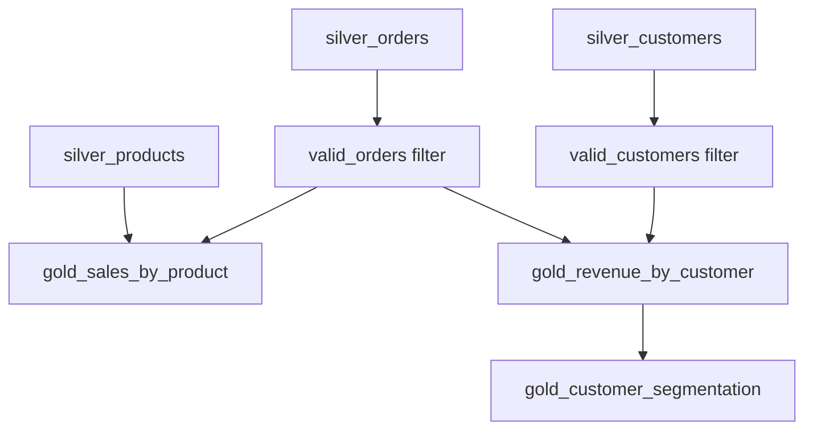

# Phase 8 — Gold Layer Implementation Specification

**Status:** Specification only — do not implement until instructed  
**Source of truth:** `data-model.md`, `data-quality-strategy.md`, `design-notes.md`  
**Prerequisite:** Phase 7 Silver layer complete (`silver_customers`, `silver_orders`, `silver_products`, `dq_metrics`, `dq_metrics_by_rule`)

---

## 1. Phase 8 Objective

Implement the Gold layer to:

1. Read Silver Delta tables as the sole analytical input for business aggregations.
2. Compute approved revenue, order-count, and customer-segmentation metrics from **valid** Silver records only.
3. Materialize three Gold Delta tables required by the approved design and dashboard mapping.
4. Preserve the approved exclusion policy: invalid Silver orders and customers remain in Silver for audit but do **not** contribute to Gold metrics.
5. Provide testable, deterministic business outputs that downstream Phase 9 dashboard queries can consume.

Gold is the **business aggregation layer**. It must not re-validate, repair, or re-flag data-quality issues — Silver owns validation; Gold applies the approved inclusion/exclusion policy.

---

## 2. Gold Layer Purpose and Business Role

Per `design-notes.md` §3.2 and `data-model.md` §9:

| Aspect | Definition |
|---|---|
| **Purpose** | Business-level analytical outputs for e-commerce sales reporting |
| **Consumers** | Phase 9 Databricks SQL Dashboard (`gold_sales_by_product`, `gold_revenue_by_customer`, `gold_customer_segmentation`) |
| **Input layer** | Silver only (conformed types, `line_revenue`, `is_valid_record`) |
| **Output format** | Materialized Delta tables, full refresh (`overwrite`) per pipeline run |
| **Currency** | USD implied; single currency, no FX conversion (`data-model.md` §5) |

Gold answers three approved business questions:

1. **Which products drive revenue?** → `gold_sales_by_product`
2. **What is each valid customer's revenue profile and segment?** → `gold_revenue_by_customer`
3. **How are valid customers distributed across revenue segments?** → `gold_customer_segmentation`

---

## 3. Silver Inputs

### 3.1 Source tables

| Silver table | Expected row count | Role in Gold |
|---|---|---|
| `silver_customers` | 10,015 | Customer dimension; validity filter for customer-level Gold |
| `silver_orders` | 100,035 | Fact source for revenue/order metrics (valid rows only) |
| `silver_products` | 500 | Product dimension for product-level Gold |

Default qualified names (configurable):

- `medallion_eval.silver.silver_customers`
- `medallion_eval.silver.silver_orders`
- `medallion_eval.silver.silver_products`

### 3.2 Silver columns consumed by Gold

**From `silver_customers`:**

| Column | Gold usage |
|---|---|
| `customer_id` | Join key to valid orders; output key in `gold_revenue_by_customer` |
| `customer_name` | Output attribute in `gold_revenue_by_customer` |
| `is_valid_record` | **Inclusion filter** for customer-level Gold |
| `signup_channel` | **Not specified in the approved design** as a Gold output column; retained in Silver for contextual documentation only (`design-notes.md` §7.3) |

**From `silver_orders`:**

| Column | Gold usage |
|---|---|
| `order_id` | `COUNT(DISTINCT order_id)` for `total_orders` |
| `customer_id` | Join key to customers |
| `product_id` | Join key to products |
| `line_revenue` | `SUM(line_revenue)` for `total_revenue` |
| `is_valid_record` | **Inclusion filter** for all order-based aggregations |

**From `silver_products`:**

| Column | Gold usage |
|---|---|
| `product_id` | Join key; output key in `gold_sales_by_product` |
| `product_name` | Output attribute |
| `category` | Output attribute |
| `is_active` | **Not specified in the approved design** as a Gold filter; all `silver_products` rows are included per §10.3 |

### 3.3 Silver columns explicitly NOT carried into Gold

Bronze/Silver metadata and DQ diagnostic columns must **not** appear in Gold outputs:

- `_ingest_batch_id`, `_ingest_timestamp`, `_source_file`, `_source_row_number`, `_bronze_record_id`
- Per-rule DQ flags (`is_email_complete`, `is_order_id_unique`, etc.)
- `dq_failure_reasons`

### 3.4 Read behavior

- Read Silver tables via configurable Delta paths / qualified names.
- Do **not** read Bronze tables in Gold processing.
- Do **not** re-run Silver DQ logic in Gold.

---

## 4. Required Gold Tables

Default schema: `medallion_eval.gold`  
Write mode: Delta `overwrite` (full refresh per run, consistent with Bronze/Silver)

| Table | Purpose |
|---|---|
| `gold_sales_by_product` | Product-level sales aggregates |
| `gold_revenue_by_customer` | Customer-level revenue, segment, and LTV |
| `gold_customer_segmentation` | Segment-level rollups |

---

## 5. Required Columns and Data Types

Per `data-model.md` §9.

### 5.1 `gold_sales_by_product`

| Column | Type | Definition |
|---|---|---|
| `product_id` | string | `silver_products.product_id` |
| `product_name` | string | `silver_products.product_name` |
| `category` | string | `silver_products.category` |
| `total_orders` | long | `COUNT(DISTINCT order_id)` from valid `silver_orders` |
| `total_revenue` | decimal(12,2) | `SUM(line_revenue)` from valid `silver_orders` |
| `average_order_value` | decimal(12,2) | `total_revenue / total_orders`; null if `total_orders = 0` |

### 5.2 `gold_revenue_by_customer`

| Column | Type | Definition |
|---|---|---|
| `customer_id` | string | `silver_customers.customer_id` where `is_valid_record = true` |
| `customer_name` | string | `silver_customers.customer_name` |
| `customer_segment` | string | Derived from `total_revenue` per segmentation model (§7) |
| `total_orders` | long | Valid orders per customer |
| `total_revenue` | decimal(12,2) | Sum of `line_revenue` for valid orders per customer |
| `average_order_value` | decimal(12,2) | `total_revenue / total_orders`; null if `total_orders = 0` |
| `lifetime_value_actual` | decimal(12,2) | **Equal to `total_revenue`** (`design-notes.md` decision #4) |

### 5.3 `gold_customer_segmentation`

| Column | Type | Definition |
|---|---|---|
| `customer_segment` | string | Segment label |
| `customer_count` | long | Distinct valid customers in segment |
| `average_revenue` | decimal(12,2) | `AVG(total_revenue)` across customers in segment |
| `total_revenue` | decimal(12,2) | `SUM(total_revenue)` across customers in segment |

---

## 6. Business Transformations and Calculations

### 6.1 Valid-order fact set

Create an internal valid-orders dataset:

```
valid_orders = silver_orders WHERE is_valid_record = true
```

All order-based metrics (`total_orders`, `total_revenue`, `line_revenue` sums) use `valid_orders` only.

### 6.2 Valid-customer dimension set

Create an internal valid-customers dataset:

```
valid_customers = silver_customers WHERE is_valid_record = true
```

Customer-level Gold uses `valid_customers` only.

### 6.3 `gold_sales_by_product` logic

1. Start from **`silver_products`** as the driving dimension (one row per product).
2. Aggregate `valid_orders` by `product_id`:
   - `total_orders = COUNT(DISTINCT order_id)`
   - `total_revenue = SUM(line_revenue)`
3. **Left join** order aggregates to `silver_products` on `product_id`.
4. For products with no matching valid orders, set `total_orders = 0` and `total_revenue = 0`.
5. Compute `average_order_value = total_revenue / total_orders` when `total_orders > 0`; otherwise `null`.

**Product inclusion policy (resolved per approved design recommendation — §10.3):** Include **all** `silver_products` rows. Products with zero valid orders remain in Gold with zero order/revenue measures. Do not emit rows for products that do not exist in `silver_products`.

### 6.4 `gold_revenue_by_customer` logic

1. Aggregate `valid_orders` by `customer_id`:
   - `total_orders = COUNT(DISTINCT order_id)`
   - `total_revenue = SUM(line_revenue)`
2. Start from `valid_customers`.
3. Left join order aggregates on `customer_id` so customers with zero valid orders are retained with zero/null metrics (`design-notes.md` §7.1).
4. Compute `average_order_value = total_revenue / total_orders` when `total_orders > 0`; otherwise `null`.
5. Assign `customer_segment` from `total_revenue` using thresholds in §7.
6. Set `lifetime_value_actual = total_revenue`.

### 6.5 `gold_customer_segmentation` logic

1. Source from completed `gold_revenue_by_customer` (not directly from Silver).
2. Group by `customer_segment`.
3. Compute:
   - `customer_count = COUNT(customer_id)` (or `COUNT(*)` at customer grain)
   - `average_revenue = AVG(total_revenue)`
   - `total_revenue = SUM(total_revenue)`

---

## 7. KPI Definitions

Per `data-model.md` §5–§6 and `design-notes.md` §7.2–§7.3.

| KPI / Field | Level | Formula | Notes |
|---|---|---|---|
| `line_revenue` | Order | `quantity * unit_price` | **Computed in Silver**, not Gold |
| `total_revenue` | Customer / Product | `SUM(line_revenue)` over **valid orders** | Gold |
| `total_orders` | Customer / Product | `COUNT(DISTINCT order_id)` over **valid orders** | Gold |
| `average_order_value` | Customer / Product | `total_revenue / total_orders` | `null` if `total_orders = 0` |
| `lifetime_value_actual` | Customer | **Equal to `total_revenue`** | Gold; no separate LTV model |
| `customer_segment` | Customer | Revenue-based bucket (below) | Assigned at Gold build time |
| `customer_count` | Segment | Count of customers in segment | `gold_customer_segmentation` |
| `average_revenue` | Segment | `AVG(total_revenue)` per segment | `gold_customer_segmentation` |

### 7.1 Customer segmentation thresholds

Derived at Gold build time from each valid customer's `total_revenue` (valid orders only):

| `customer_segment` | Condition on `total_revenue` |
|---|---|
| No Purchase | = 0 |
| Low Value | > 0 and < 500 |
| Mid Value | >= 500 and < 2000 |
| High Value | >= 2000 |

**Rules:**

- Segmentation is deterministic, revenue-based, and contains no machine learning (`data-model.md` §6).
- `signup_channel` does **not** drive segment assignment (`design-notes.md` §7.3).
- Segment labels must match the exact strings above (case and spacing as specified).

---

## 8. Aggregations and Grain of Each Gold Table

| Table | Grain | Grouping keys | Measures |
|---|---|---|---|
| `gold_sales_by_product` | One row per product in `silver_products` (§10.3) | `product_id` (+ `product_name`, `category` as attributes) | `total_orders`, `total_revenue`, `average_order_value` |
| `gold_revenue_by_customer` | One row per **valid** customer | `customer_id` (+ `customer_name`, `customer_segment` as attributes) | `total_orders`, `total_revenue`, `average_order_value`, `lifetime_value_actual` |
| `gold_customer_segmentation` | One row per segment | `customer_segment` | `customer_count`, `average_revenue`, `total_revenue` |

**Expected segment cardinality:** `gold_customer_segmentation` must contain **four rows** (one per segment label), including segments with zero customers if applicable.

---

## 9. How Silver DQ Flags Should Be Handled

Gold does **not** re-implement Silver DQ rules. Gold consumes only the consolidated Silver validity flag:

| Silver entity | Flag used by Gold | Gold behavior |
|---|---|---|
| Orders | `silver_orders.is_valid_record` | Include in aggregations only when `true` |
| Customers | `silver_customers.is_valid_record` | Include in `gold_revenue_by_customer` and segment counts only when `true` |
| Products | `silver_products.is_valid_record` | Always `true` in Silver; no Gold exclusion on products |

Per-rule Silver flags (`is_email_complete`, `is_order_id_unique`, `is_customer_id_valid_ref`, etc.) are **not** referenced directly in Gold logic. The approved design consolidates inclusion policy into `is_valid_record`.

**Principle (approved):** Never hide data-quality problems by deleting bad records. Invalid records remain in Silver; Gold simply excludes them from business metrics (`data-quality-strategy.md` §1, §7).

---

## 10. Invalid Silver Record Inclusion/Exclusion by Gold Table

Per `data-quality-strategy.md` §7 and `design-notes.md` §7.1.

### 10.1 Orders (`silver_orders.is_valid_record = false`)

| Gold table | Included? | Effect |
|---|---|---|
| `gold_sales_by_product` | **No** | Does not contribute to `total_orders`, `total_revenue`, or `average_order_value` |
| `gold_revenue_by_customer` | **No** | Does not contribute to any customer's metrics |
| `gold_customer_segmentation` | **No** | Indirectly excluded via `gold_revenue_by_customer` |

Invalid orders must not contribute to `total_revenue`, `total_orders`, `average_order_value`, or product/customer rollups (`data-quality-strategy.md` §7.1).

### 10.2 Customers (`silver_customers.is_valid_record = false`)

| Gold table | Included? | Effect |
|---|---|---|
| `gold_sales_by_product` | N/A (customer validity not a direct filter) | Valid orders referencing invalid customers may still count toward product metrics if the **order** is valid (`data-quality-strategy.md` §7.3) |
| `gold_revenue_by_customer` | **No** | Customer row excluded entirely |
| `gold_customer_segmentation` | **No** | Not counted in `customer_count` or segment revenue rollups |

Customers with zero valid orders but `is_valid_record = true` are **included** in `gold_revenue_by_customer` with zero revenue (`design-notes.md` §7.1).

### 10.3 Products — `gold_sales_by_product` inclusion policy (resolved)

Per `data-model.md` §9.1 and the approved design recommendation (`ai-prompts/02-design.md` §3):

| Policy | Requirement |
|---|---|
| Silver validity | All product rows are valid (`is_valid_record = true`) |
| **Driving dimension** | `silver_products` — every Silver product row produces exactly one Gold row |
| **Products with zero valid orders** | **Included** in `gold_sales_by_product`; must not be dropped |
| **`total_orders`** | `0` when the product has no valid orders |
| **`total_revenue`** | `0` when the product has no valid orders |
| **`average_order_value`** | `null` when `total_orders = 0` (per §6.3 / §7) |
| **Products not in Silver** | **Excluded** — do not create Gold rows for product IDs that do not exist in `silver_products` |
| **Grain** | One row per product; `gold_sales_by_product` row count **must equal** `silver_products` row count (**500** on project data) |

**Join pattern:** `silver_products` LEFT JOIN valid-order aggregates ON `product_id`; coalesce order/revenue measures to zero where the left join has no match.

Phase 8 tests must assert full product coverage, zero-default metrics for zero-order products, and `gold_sales_by_product` row count equal to `silver_products`.

---

## 11. Required Joins and Join Keys

| Gold output | Left / driving side | Right side | Join key | Join type |
|---|---|---|---|---|
| `gold_sales_by_product` | `silver_products` | Valid-order aggregates by `product_id` | `product_id` | **Left join** (retain all Silver products; §10.3) |
| `gold_revenue_by_customer` | `valid_customers` | Valid-order aggregates by `customer_id` | `customer_id` | Left join (retain zero-order valid customers) |
| `gold_customer_segmentation` | `gold_revenue_by_customer` | — | `customer_segment` | Group-by aggregation (no external join) |

**Valid-order aggregate subquery (reused):**

```
SELECT customer_id, product_id,
       COUNT(DISTINCT order_id) AS order_count,
       SUM(line_revenue) AS revenue_sum
FROM silver_orders
WHERE is_valid_record = true
GROUP BY customer_id, product_id
```

Product-level and customer-level Gold modules derive their aggregates from this filtered fact set.

---

## 12. Revenue / Quantity / Customer / Product Metrics

| Metric | Entity | Source column | Aggregation | Valid-data filter |
|---|---|---|---|---|
| `line_revenue` | Order | Silver `line_revenue` | Input to `SUM` | `is_valid_record = true` on orders |
| `total_revenue` | Product | `line_revenue` | `SUM` grouped by `product_id` | Valid orders only |
| `total_revenue` | Customer | `line_revenue` | `SUM` grouped by `customer_id` | Valid orders only |
| `total_revenue` | Segment | Customer `total_revenue` | `SUM` grouped by `customer_segment` | Valid customers only |
| `total_orders` | Product | `order_id` | `COUNT(DISTINCT order_id)` grouped by `product_id` | Valid orders only |
| `total_orders` | Customer | `order_id` | `COUNT(DISTINCT order_id)` grouped by `customer_id` | Valid orders only |
| `average_order_value` | Product / Customer | Derived | `total_revenue / total_orders` | `null` when `total_orders = 0` |
| `lifetime_value_actual` | Customer | Derived | `= total_revenue` | Valid customer + valid orders |
| `customer_count` | Segment | `customer_id` | `COUNT` grouped by `customer_segment` | Valid customers only |
| `average_revenue` | Segment | Customer `total_revenue` | `AVG` grouped by `customer_segment` | Valid customers only |

**Quantity (`quantity`)** is not a Gold output column in the approved design. It is consumed only indirectly via `line_revenue` in Silver.

---

## 13. Required DQ or Reconciliation Metrics

### 13.1 Gold-native DQ tables

**Not specified in the approved design.** Gold does not produce new `dq_*` tables. Silver owns `dq_metrics` and `dq_metrics_by_rule`.

### 13.2 Gold reconciliation expectations (test-driven)

Per `data-quality-strategy.md` §8.2, Phase 8 tests must verify:

| Reconciliation check | Assertion |
|---|---|
| Invalid order exclusion | Injected bad orders do not affect Gold totals |
| Gold calculations | Known fixture totals; `average_order_value = total_revenue / total_orders` where applicable |
| `lifetime_value_actual` | Equals `total_revenue` on fixture data |
| Segment assignment | Threshold boundaries applied correctly |
| Segment cardinality | `gold_customer_segmentation` has four segment rows |

### 13.3 Test fixture reference

`data-quality-strategy.md` §8.3 references:

| Fixture | Purpose |
|---|---|
| `tests/fixtures/gold_expected.json` | Expected Gold aggregates on minimal set |

**Current repository status:** `tests/fixtures/gold_expected.json` is **not yet present** in the repository. Phase 8 implementation should create this fixture (or an equivalent committed test artifact) per the approved testing strategy.

---

## 14. Expected Row Counts and Validation Expectations

### 14.1 Silver inputs (unchanged)

| Entity | Silver row count |
|---|---|
| customers | 10,015 |
| orders | 100,035 |
| products | 500 |

Gold does not alter Silver row counts.

### 14.2 Gold outputs

| Table | Expected row count | Source |
|---|---|---|
| `gold_customer_segmentation` | **4** | One row per segment label (`data-model.md` §9.3) |
| `gold_revenue_by_customer` | **Not specified in the approved design** as a fixed integer | Equals count of `silver_customers` where `is_valid_record = true` |
| `gold_sales_by_product` | **500** | Must equal `silver_products` row count (§10.3); one row per Silver product |

### 14.3 Metric validation expectations

| Validation | Expectation |
|---|---|
| `lifetime_value_actual` | Must equal `total_revenue` for every row in `gold_revenue_by_customer` |
| `average_order_value` | Must equal `total_revenue / total_orders` when `total_orders > 0`; otherwise `null` |
| Invalid order contribution | Sum of `line_revenue` from `silver_orders WHERE is_valid_record = false` must not appear in any Gold `total_revenue` |
| Invalid customer presence | `customer_id` values from `silver_customers WHERE is_valid_record = false` must not appear in `gold_revenue_by_customer` |
| Segment labels | Only the four approved labels (§7.1) |
| Currency precision | Revenue columns `decimal(12,2)`; `line_revenue` source is `decimal(10,2)` from Silver |

**Exact numeric Gold totals on full generated data:** Not specified in the approved design. Tests may compute expected values dynamically from filtered Silver data or use `tests/fixtures/gold_expected.json` on a minimal fixture set.

---

## 15. Required Gold Tests

Phase 8 tests only (do not implement Dashboard tests in this phase). Use pytest + local SparkSession (same pattern as Bronze/Silver).

Add `tests/test_gold.py` and extend `tests/conftest.py` with session-scoped Gold fixtures (mirror Silver: run Gold once per session against shared Bronze/Silver session data).

### 15.1 Table existence and schema

- All three Gold tables exist after pipeline run.
- Required business columns and types match §5.

### 15.2 Invalid record exclusion

- Invalid Silver orders do not contribute to `gold_sales_by_product` or `gold_revenue_by_customer` totals.
- Invalid Silver customers do not appear in `gold_revenue_by_customer` or `gold_customer_segmentation` counts.

### 15.3 Revenue and order calculations

- `total_revenue` equals sum of `line_revenue` from valid orders (reconciled per entity).
- `total_orders` equals `COUNT(DISTINCT order_id)` from valid orders.
- `average_order_value = total_revenue / total_orders` when `total_orders > 0`.
- `average_order_value` is `null` when `total_orders = 0`.

### 15.4 Customer metrics

- `lifetime_value_actual` equals `total_revenue` for every customer row.
- Valid customers with zero valid orders appear in `gold_revenue_by_customer` with `total_revenue = 0` (or null coerced consistently — document choice).

### 15.5 Segmentation

- `customer_segment` assigned per approved thresholds (§7.1).
- `gold_customer_segmentation` contains exactly **4** rows.
- `customer_count`, `average_revenue`, `total_revenue` reconcile to `gold_revenue_by_customer`.

### 15.6 Product metrics

- `gold_sales_by_product` row count equals `silver_products` row count (**500** on project data).
- Every `product_id` in `silver_products` appears exactly once in `gold_sales_by_product`.
- Products with zero valid orders have `total_orders = 0`, `total_revenue = 0`, and `average_order_value = null`.
- No Gold rows exist for product IDs absent from `silver_products`.
- Product attributes (`product_name`, `category`) match `silver_products`.

### 15.7 Fixture-based tests

- Load expected values from `tests/fixtures/gold_expected.json` when created.
- Cross-reference `tests/fixtures/manifest_expected_counts.json` only for Silver DQ context (not Gold row counts).

### 15.8 Regression

- Full project pytest suite must continue to pass (39 existing tests + new Gold tests).

---

## 16. Required Implementation Modules

Under `src/gold/` (follow Bronze/Silver package patterns):

| Module | Responsibility |
|---|---|
| `__init__.py` | Package marker |
| `schemas.py` | Gold output schemas, column lists, segment constants |
| `filters.py` | `valid_orders` and `valid_customers` DataFrame filters |
| `sales_by_product.py` | Build `gold_sales_by_product` |
| `revenue_by_customer.py` | Build `gold_revenue_by_customer` (includes segment assignment) |
| `customer_segmentation.py` | Build `gold_customer_segmentation` from customer Gold |
| `transform.py` | Orchestrate Gold pipeline, read Silver, write Gold Delta tables |
| `run_gold.py` | CLI / pipeline entry point |

Reuse existing shared utilities:

- `src/common/config.py` — extend or add `GoldSettings` (catalog, schema, paths, segmentation thresholds)
- `src/common/spark_session.py` — Spark session creation (do not change package versions)

**Separation requirement:** Keep product, customer, and segmentation logic in separate reviewable modules — not one opaque transformation.

---

## 17. Optional Databricks Notebook Structure

Thin notebook pattern (consistent with Bronze/Silver):

**File:** `notebooks/04_gold_transform.py`

```
# COMMAND ----------
# Thin orchestration notebook for Phase 8 Gold transformation.
# Expects repository `src/` package on the Python path.

# COMMAND ----------
# Add src/ to path

# COMMAND ----------
from gold.run_gold import run_gold_transformation
from common.spark_session import create_spark_session

spark = create_spark_session("gold-transformation-notebook")
result = run_gold_transformation(spark)

# COMMAND ----------
# Print table row counts / paths
```

**Rule:** No business logic in the notebook — delegate to `src/gold/`.

---

## 18. Execution Order / Dependencies



### 18.1 Pipeline steps

1. **Read Silver:** `silver_customers`, `silver_orders`, `silver_products`
2. **Filter:** `valid_orders`, `valid_customers`
3. **Build `gold_sales_by_product`:** valid-order aggregates + product dimension
4. **Build `gold_revenue_by_customer`:** valid customers + valid-order aggregates + segment assignment + `lifetime_value_actual`
5. **Build `gold_customer_segmentation`:** aggregate from `gold_revenue_by_customer`
6. **Write** all three Gold Delta tables (`overwrite`)

### 18.2 Dependencies

| Step | Depends on |
|---|---|
| `gold_sales_by_product` | `silver_orders`, `silver_products` |
| `gold_revenue_by_customer` | `silver_customers`, `silver_orders` |
| `gold_customer_segmentation` | `gold_revenue_by_customer` |
| Gold pipeline | Phase 7 Silver tables must exist |

**Prerequisite run order:** Bronze → Silver → Gold

---

## 19. Explicit Non-Goals (Phase 8)

Do **not** implement in this phase:

- Databricks SQL dashboard (Phase 9)
- Dashboard SQL assets under `resources/dashboard/` (Phase 9)
- Changes to Bronze ingestion logic
- Changes to Silver validation logic or DQ metrics
- Changes to Phase 5 data generation
- New KPIs or business rules beyond approved design
- New Gold tables beyond the three specified
- `signup_channel` in Gold outputs (not in approved Gold column lists)
- Customer segmentation by channel or ML-based scoring
- Incremental Gold processing / merge (full `overwrite` only per design)
- Gold-native DQ metrics tables
- Modifications to `requirements-analysis.md`, `design-notes.md`, `data-model.md`, or `data-quality-strategy.md` unless a genuine contradiction is discovered

---

## 20. Acceptance Criteria

Phase 8 is complete when:

| # | Criterion |
|---|---|
| 1 | `gold_sales_by_product`, `gold_revenue_by_customer`, `gold_customer_segmentation` exist as Delta tables in configurable `medallion_eval.gold` |
| 2 | All columns and types match §5 |
| 3 | KPI formulas match §6–§7 |
| 4 | Invalid Silver orders excluded from all Gold revenue/order rollups |
| 5 | Invalid Silver customers excluded from `gold_revenue_by_customer` and `gold_customer_segmentation` |
| 6 | Valid customers with zero valid orders included in `gold_revenue_by_customer` |
| 7 | `lifetime_value_actual = total_revenue` on all customer rows |
| 8 | `gold_customer_segmentation` contains four segment rows with correct rollups |
| 9 | `gold_sales_by_product` includes all `silver_products` rows; zero-order products have zero `total_orders` and `total_revenue` (§10.3) |
| 10 | Phase 8 pytest suite passes |
| 11 | Full project pytest suite passes (39+ tests; count grows with Gold tests) |
| 12 | No secrets committed; generated Delta under gitignored paths |
| 13 | `ai-prompts/06-gold.md` updated with implementation notes after completion |

---

## 21. Git / Commit Expectations

Per project workflow (`design-notes.md`, cursor-rules):

| Expectation | Detail |
|---|---|
| Incremental commits | Meaningful milestones, not noise commits |
| Suggested commit sequence | filters → sales_by_product → revenue_by_customer → segmentation → transform/run → tests → notebook/docs |
| Suggested commit message theme | `Implement Phase 8 Gold <milestone>` |
| Documentation commit | Separate commit for `ai-prompts/06-gold.md` implementation notes if desired (mirror Phase 6/7 pattern) |
| Do not commit | `data/raw/*.csv`, `data/delta/`, `.tools/` |
| Do not modify | Phase 4 design docs unless genuine contradiction found |
| Branch safety | Work on feature branch; do not push directly to main |

---

## Appendix — Quick Reference

| Item | Value |
|---|---|
| Catalog (default) | `medallion_eval` |
| Gold schema (default) | `gold` |
| Silver inputs | `silver_customers`, `silver_orders`, `silver_products` |
| Gold outputs | `gold_sales_by_product`, `gold_revenue_by_customer`, `gold_customer_segmentation` |
| Order filter | `silver_orders.is_valid_record = true` |
| Customer filter | `silver_customers.is_valid_record = true` |
| LTV definition | `lifetime_value_actual = total_revenue` |
| Segments | No Purchase / Low Value / Mid Value / High Value |
| `gold_sales_by_product` row count | **500** (= `silver_products`; §10.3) |
| Product inclusion | All Silver products; zero metrics for zero valid orders |
| Dashboard mapping (Phase 9) | `data-model.md` §12 |

**Core principle (approved):** Gold aggregates business metrics from valid Silver data only. Invalid records remain in Silver for audit.
