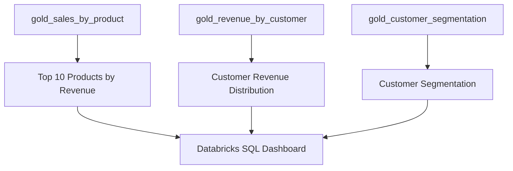

# Phase 9 — Databricks SQL Dashboard Implementation Specification

**Status:** Specification only — do not implement until instructed  
**Source of truth:** `data-model.md`, `data-quality-strategy.md`, `design-notes.md`, `requirements-analysis.md`  
**Prerequisite:** Phase 8 Gold layer complete (`gold_sales_by_product`, `gold_revenue_by_customer`, `gold_customer_segmentation`)

---

## 1. Phase 9 Objective

Implement the Databricks SQL Dashboard that consumes Phase 8 Gold tables and delivers the three required business visualizations specified in the approved project design.

Phase 9 must:

1. Publish SQL query assets that read Gold Delta tables (not Silver or Bronze).
2. Assemble exactly **three** required visualizations into **one** Databricks SQL dashboard.
3. Map each visualization to the approved Gold source table and chart type per `design-notes.md` §8 and `data-model.md` §12.
4. Document dashboard setup and validation steps for workspace deployment.
5. Preserve the approved catalog/schema naming conventions (`medallion_eval.gold` by default).

Phase 9 is a **consumption and presentation layer**. It must not recompute Gold business logic, re-run Silver DQ checks, or modify pipeline tables.

---

## 2. Business Purpose

Per `design-notes.md` §1 and §3.2:

| Aspect | Definition |
|---|---|
| **Purpose** | End-user analytical consumption of e-commerce sales insights from validated Gold data |
| **Audience** | Business/analytics users reviewing product performance, customer revenue distribution, and customer segmentation |
| **Upstream flow** | CSV → Bronze → Silver → Gold → **Databricks SQL Dashboard** |
| **Value** | Makes Gold KPIs visible without requiring users to query raw or Silver layers |

The dashboard answers three approved business questions already modeled in Gold:

1. **Which products generate the most revenue?** → Top 10 Products by Revenue
2. **How is customer revenue distributed?** → Customer Revenue Distribution
3. **How are customers grouped by revenue segment?** → Customer Segmentation

---

## 3. Inputs from Gold

### 3.1 Source tables

Default qualified names (configurable):

| Gold table | Default path | Row-count context (project data) |
|---|---|---|
| `gold_sales_by_product` | `medallion_eval.gold.gold_sales_by_product` | **500** (one row per `silver_products`) |
| `gold_revenue_by_customer` | `medallion_eval.gold.gold_revenue_by_customer` | Valid customers only (count not fixed in design) |
| `gold_customer_segmentation` | `medallion_eval.gold.gold_customer_segmentation` | **4** (one row per segment label) |

### 3.2 Columns consumed per visualization

Per `data-model.md` §12 and `design-notes.md` §8:

**Visualization 1 — Top 10 Products by Revenue**

| Column | Source table | Usage |
|---|---|---|
| `product_name` | `gold_sales_by_product` | Category/label axis |
| `total_revenue` | `gold_sales_by_product` | Value axis; ranking metric |

Additional columns available but not required by design for this widget: `product_id`, `category`, `total_orders`, `average_order_value`.

**Visualization 2 — Customer Revenue Distribution**

| Column | Source table | Usage |
|---|---|---|
| `total_revenue` | `gold_revenue_by_customer` | Distribution measure (histogram input) |

Additional columns available but not required by design for this widget: `customer_id`, `customer_name`, `customer_segment`, `total_orders`, `average_order_value`, `lifetime_value_actual`.

**Visualization 3 — Customer Segmentation**

| Column | Source table | Usage |
|---|---|---|
| `customer_segment` | `gold_customer_segmentation` | Category axis |
| `total_revenue` | `gold_customer_segmentation` | Primary value axis (per approved chart mapping) |
| `customer_count` | `gold_customer_segmentation` | Available in source table (`data-model.md` §12) |
| `average_revenue` | `gold_customer_segmentation` | Available in source table (`data-model.md` §12) |

### 3.3 Tables explicitly NOT used by Phase 9

Per approved design, the dashboard reads **Gold only**:

| Layer / table | Phase 9 usage |
|---|---|
| Bronze tables | **Not used** |
| Silver tables | **Not used** |
| `dq_metrics`, `dq_metrics_by_rule` | **Not used** (Silver/DQ layer; no dashboard mapping in design) |

### 3.4 Data freshness dependency

Dashboard queries assume Gold tables are populated by the Phase 8 pipeline (`notebooks/04_gold_transform.py` / `gold.run_gold_transformation`) after Bronze and Silver have run.

**Orchestration schedule:** Not specified in the approved design.

---

## 4. Required Outputs / Components

Per `design-notes.md` §8 and §9:

| Output | Path (proposed per design) | Purpose |
|---|---|---|
| SQL query — Top 10 Products | `resources/dashboard/queries/top_10_products_by_revenue.sql` | Query asset for visualization 1 |
| SQL query — Customer Revenue Distribution | `resources/dashboard/queries/customer_revenue_distribution.sql` | Query asset for visualization 2 |
| SQL query — Customer Segmentation | `resources/dashboard/queries/customer_segmentation.sql` | Query asset for visualization 3 |
| Dashboard setup guide | `resources/dashboard/dashboard_config.md` | Workspace setup, widget mapping, validation checklist |
| Databricks SQL dashboard | Published in Databricks workspace | One dashboard containing all three visualizations |

**Note:** Exact SQL filenames may use kebab-case or snake_case consistent with repository conventions; the design specifies the `resources/dashboard/queries/*.sql` pattern, not individual filenames.

### 4.1 Optional notebook

**Not specified in the approved design** as a required deliverable for Phase 9.

If a thin orchestration notebook is added for consistency with Bronze/Silver/Gold, it must contain **no business logic** and only document/manual steps for dashboard creation. This is an implementation choice, not a design requirement.

---

## 5. Required Schemas / Configuration

### 5.1 Gold table schemas (read-only reference)

Phase 9 consumes existing Gold schemas from Phase 8. Do not redefine business logic.

**`gold_sales_by_product`:** `product_id`, `product_name`, `category`, `total_orders`, `total_revenue`, `average_order_value`

**`gold_revenue_by_customer`:** `customer_id`, `customer_name`, `customer_segment`, `total_orders`, `total_revenue`, `average_order_value`, `lifetime_value_actual`

**`gold_customer_segmentation`:** `customer_segment`, `customer_count`, `average_revenue`, `total_revenue`

Types per `data-model.md` §9 and Phase 8 implementation (`decimal(12,2)` for revenue fields).

### 5.2 Catalog and schema configuration

| Setting | Default | Configurable |
|---|---|---|
| Catalog | `medallion_eval` | Yes (`DATABRICKS_CATALOG` / workspace config) |
| Gold schema | `gold` | Yes (`GOLD_SCHEMA` / workspace config) |

Queries must use configurable catalog/schema references (parameterized SQL, variables, or documented substitution) so the same assets work across environments without hard-coding workspace-specific names beyond the approved default.

**Unity Catalog requirement:** Not specified in the approved design. Implementation must remain compatible with the catalog-portability rule in `design-notes.md` §3.3 (do not assume Unity Catalog is enabled).

### 5.3 Segment label constants

Dashboard queries/visualizations must use the approved segment labels exactly:

| `customer_segment` |
|---|
| No Purchase |
| Low Value |
| Mid Value |
| High Value |

### 5.4 Secrets and credentials

Per `design-notes.md` §10:

- Databricks tokens, passwords, and workspace secrets must **not** be committed to Git.
- Use environment variables or Databricks secret scopes for authentication.

**Row-level security / table ACLs:** Not specified in the approved design.

---

## 6. Business Logic and KPI Definitions

Phase 9 **displays** KPIs computed in Gold; it does **not** redefine them.

| KPI / field | Definition (from Gold) | Dashboard exposure |
|---|---|---|
| `total_revenue` | `SUM(line_revenue)` over valid orders (product/customer/segment level) | All three visualizations |
| `total_orders` | `COUNT(DISTINCT order_id)` over valid orders | Available in Gold; not required on dashboard per design |
| `average_order_value` | `total_revenue / total_orders`; null when `total_orders = 0` | Available in Gold; not required on dashboard per design |
| `lifetime_value_actual` | Equal to `total_revenue` per customer | Available in Gold; not required on dashboard per design |
| `customer_segment` | Revenue-based bucket per approved thresholds | Segmentation visualization |
| `customer_count` | Count of valid customers per segment | Available in `gold_customer_segmentation` |
| `average_revenue` | `AVG(total_revenue)` per segment | Available in `gold_customer_segmentation` |

**Currency:** USD implied; single currency (`data-model.md` §5).

### 6.1 Query logic requirements (presentation layer only)

**Visualization 1 — Top 10 Products by Revenue**

| Rule | Requirement |
|---|---|
| Source | `gold_sales_by_product` |
| Ranking | Order by `total_revenue` descending |
| Row limit | **At most 10 products** (`requirements-analysis.md` Phase 9 acceptance criteria) |
| Chart type | **Horizontal bar chart** (`design-notes.md` §8) |
| Axes | `product_name` (label), `total_revenue` (value) per `data-model.md` §12 |

**Visualization 2 — Customer Revenue Distribution**

| Rule | Requirement |
|---|---|
| Source | `gold_revenue_by_customer` |
| Measure | `total_revenue` per valid customer |
| Chart type | **Histogram of `total_revenue`** (`design-notes.md` §8) |
| Bin boundaries | **Not specified in the approved design** (`ai-prompts/02-design.md` notes exact bins deferred to Phase 9; no numeric bin spec provided) |

**Visualization 3 — Customer Segmentation**

| Rule | Requirement |
|---|---|
| Source | `gold_customer_segmentation` |
| Chart type | **Bar chart** (`design-notes.md` §8) |
| Axes | `customer_segment` vs `total_revenue` (`design-notes.md` §8) |
| Additional fields | `customer_count`, `average_revenue` available in source; display in chart or tooltip is **not specified in the approved design** |

---

## 7. Expected User / Consumer Behavior

### 7.1 Intended usage

| Behavior | Specification |
|---|---|
| Open dashboard | User views a single Databricks SQL dashboard with three widgets |
| Interpret product performance | Top 10 chart shows highest-revenue products from Gold |
| Interpret customer revenue spread | Histogram shows distribution of `total_revenue` across valid customers |
| Interpret segmentation | Bar chart compares segments by `total_revenue` |

### 7.2 Filters / slicers

Per `requirements-analysis.md` §7:

- **Optional dashboard filters are not required** beyond the three visualizations.
- Required filters/slicers (date range, category, segment, etc.): **Not specified in the approved design.**

### 7.3 Interaction / navigation

| Requirement | Status |
|---|---|
| Cross-filtering between widgets | **Not specified in the approved design** |
| Drill-down to customer/product detail | **Not specified in the approved design** |
| Dashboard navigation / multi-page layout | **Not specified in the approved design** |
| Export / download | **Not specified in the approved design** |

### 7.4 Performance expectations

**Not specified in the approved design.**

Reasonable implementation assumption for documentation only: queries run against small Gold aggregates (≤500 product rows, ~10k valid customer rows max, 4 segment rows) and should be interactive in a Databricks SQL workspace. This is **not** an approved SLA.

---

## 8. Data Dependencies



### 8.1 Pipeline prerequisite order

1. Phase 5 — generate CSVs (`data/raw/`)
2. Phase 6 — Bronze ingest
3. Phase 7 — Silver transform + DQ metrics
4. Phase 8 — Gold transform
5. **Phase 9 — Dashboard** (queries + published dashboard)

### 8.2 Data-model relationships relevant to dashboard

The dashboard consumes **pre-aggregated** Gold tables. No joins between Gold tables are required by the approved design for the three visualizations.

| Relationship | Dashboard impact |
|---|---|
| Product sales ← valid orders | Already aggregated in `gold_sales_by_product` |
| Customer revenue ← valid orders | Already aggregated in `gold_revenue_by_customer` |
| Segments ← customer revenue | Already aggregated in `gold_customer_segmentation` |
| Invalid Silver records | Excluded upstream in Gold; dashboard shows valid-data metrics only |

---

## 9. Validation / Testing Requirements

### 9.1 Automated pytest coverage

Per `design-notes.md` §11 and `cursor-workflow/task-breakdown.md`:

| Test type | Phase 9 scope |
|---|---|
| Local pytest (existing 57 passed + 1 skipped baseline) | **Must continue to pass**; Phase 9 should not break Bronze/Silver/Gold tests |
| New automated dashboard tests in pytest | **Not specified in the approved design** |

Phase 10 (`cursor-workflow/task-breakdown.md`) covers broader automated testing; dashboard-specific automated testing is **not explicitly required** in Phase 9 design docs.

### 9.2 Workspace validation (required)

Per `design-notes.md` §11 and `data-quality-strategy.md` §8.1:

| Validation | Requirement |
|---|---|
| Each SQL query executes successfully against populated Gold tables | Required |
| Top 10 query returns ≤10 rows ordered by `total_revenue` DESC | Required (`requirements-analysis.md` Phase 9) |
| Customer Revenue Distribution query returns `total_revenue` from `gold_revenue_by_customer` | Required |
| Customer Segmentation query reads `gold_customer_segmentation` | Required |
| Dashboard renders all three visualizations | Required |
| Chart types match approved design where specified | Required (horizontal bar, histogram, bar) |

### 9.3 Validation checklist (document in `dashboard_config.md`)

| # | Check |
|---|---|
| 1 | Gold tables exist at configured catalog/schema paths |
| 2 | `top_10_products_by_revenue.sql` returns ≤10 rows |
| 3 | `customer_revenue_distribution.sql` returns one row per valid customer with `total_revenue` |
| 4 | `customer_segmentation.sql` returns 4 segment rows |
| 5 | Dashboard published and accessible in Databricks SQL |
| 6 | No credentials committed to Git |

### 9.4 SQL query review criteria

- Queries reference Gold tables only.
- No recomputation of `line_revenue`, segmentation thresholds, or DQ filters in SQL.
- `LIMIT 10` (or equivalent) applied only to Top 10 Products query.
- Qualified table names align with configurable `medallion_eval.gold` default.

---

## 10. Implementation Structure

Phase 9 is primarily **SQL assets + documentation**, not a new `src/` Python package.

### 10.1 Required repository artifacts

```
resources/dashboard/
  queries/
    top_10_products_by_revenue.sql
    customer_revenue_distribution.sql
    customer_segmentation.sql
  dashboard_config.md
```

### 10.2 Suggested SQL query patterns

**Top 10 Products (illustrative structure — implementer must match Gold schema):**

```sql
SELECT product_name, total_revenue
FROM {catalog}.{gold_schema}.gold_sales_by_product
ORDER BY total_revenue DESC
LIMIT 10;
```

**Customer Revenue Distribution (illustrative):**

```sql
SELECT total_revenue
FROM {catalog}.{gold_schema}.gold_revenue_by_customer;
```

**Customer Segmentation (illustrative):**

```sql
SELECT customer_segment, customer_count, average_revenue, total_revenue
FROM {catalog}.{gold_schema}.gold_customer_segmentation
ORDER BY customer_segment;
```

Exact `ORDER BY` for segments: **Not specified in the approved design** (logical segment order may be documented in `dashboard_config.md`).

### 10.3 Databricks workspace steps (document, do not hard-code secrets)

`dashboard_config.md` should document:

1. Verify Gold tables in SQL editor
2. Create/import the three SQL queries
3. Create Databricks SQL dashboard
4. Add visualization 1 — horizontal bar — Top 10 Products
5. Add visualization 2 — histogram — Customer Revenue Distribution
6. Add visualization 3 — bar chart — Customer Segmentation (`customer_segment` vs `total_revenue`)
7. Publish/share dashboard per workspace policy

**Lakeview vs. legacy SQL dashboard:** **Not specified in the approved design** — document the chosen approach in `dashboard_config.md`.

### 10.4 What Phase 9 does NOT add under `src/`

| Component | Status |
|---|---|
| `src/dashboard/` Python package | **Not specified in the approved design** |
| Changes to `src/gold/` | **Prohibited** |
| Changes to `src/silver/` or `src/bronze/` | **Prohibited** |

---

## 11. Explicit Non-Goals (Phase 9)

Do **not** implement in this phase:

- Changes to Bronze, Silver, or Gold pipeline code
- New Gold tables or KPIs
- Silver/Bronze/DQ visualizations
- Databricks Workflows / job orchestration (unless already elsewhere; **not specified** for Phase 9)
- Additional dashboard widgets beyond the three required visualizations
- Real-time/streaming dashboards
- ML or predictive analytics
- Customer segmentation logic (belongs in Gold; already implemented)
- `signup_channel` analysis on dashboard (**not in approved dashboard mapping**)
- Automated dashboard CI in pytest (**not specified**; deferred unless added in Phase 10+)
- Modifications to Phase 4 design documents unless a genuine contradiction is discovered
- Committing Databricks credentials, tokens, or workspace URLs with secrets

---

## 12. Acceptance Criteria

Phase 9 is complete when:

| # | Criterion |
|---|---|
| 1 | `resources/dashboard/queries/` contains SQL for all three required visualizations |
| 2 | `resources/dashboard/dashboard_config.md` documents setup and validation |
| 3 | One Databricks SQL dashboard is published with all three required visualizations |
| 4 | **Top 10 Products by Revenue** uses `gold_sales_by_product`, shows ≤10 products ranked by `total_revenue` DESC, horizontal bar chart |
| 5 | **Customer Revenue Distribution** uses `gold_revenue_by_customer`, histogram of `total_revenue` |
| 6 | **Customer Segmentation** uses `gold_customer_segmentation`, bar chart of `customer_segment` vs `total_revenue` |
| 7 | Queries read Gold tables only; no Silver/Bronze references |
| 8 | No secrets committed to Git |
| 9 | Existing pytest suite still passes (57 passed + 1 skipped baseline at Phase 8 completion) |
| 10 | `ai-prompts/07-dashboard.md` updated with implementation notes after completion |

---

## 13. Git / Commit Expectations

Per `design-notes.md` §12 and project workflow:

| Expectation | Detail |
|---|---|
| Incremental commits | Meaningful milestones: SQL queries → dashboard config → docs |
| Suggested commit message theme | `Implement Phase 9 Databricks SQL dashboard` or `Add dashboard SQL queries and setup guide` |
| Documentation commit | Optional separate commit for `ai-prompts/07-dashboard.md` implementation notes (mirror Phase 6–8 pattern) |
| Do commit | `resources/dashboard/queries/*.sql`, `resources/dashboard/dashboard_config.md` |
| Do not commit | Databricks tokens, passwords, personal workspace URLs with embedded secrets |
| Do not modify | `src/bronze/`, `src/silver/`, `src/gold/`, Phase 4 design docs |
| Branch safety | Work on feature branch; do not push directly to main |

---

## Appendix — Quick Reference

| Item | Value |
|---|---|
| Platform | Databricks SQL Dashboard |
| Gold inputs | `gold_sales_by_product`, `gold_revenue_by_customer`, `gold_customer_segmentation` |
| Default catalog.schema | `medallion_eval.gold` |
| Visualization 1 | Top 10 Products by Revenue — horizontal bar — `product_name`, `total_revenue` |
| Visualization 2 | Customer Revenue Distribution — histogram — `total_revenue` |
| Visualization 3 | Customer Segmentation — bar chart — `customer_segment`, `total_revenue` |
| Required filters | None beyond three widgets (per requirements-analysis) |
| Query assets path | `resources/dashboard/queries/*.sql` |
| Setup guide path | `resources/dashboard/dashboard_config.md` |
| Next phase (per task-breakdown) | Phase 10 — Testing (broader automated test coverage) |

**Core principle (approved):** The dashboard consumes validated Gold aggregates only. Data-quality problems remain visible in Silver; Gold excludes invalid records from displayed KPIs.
